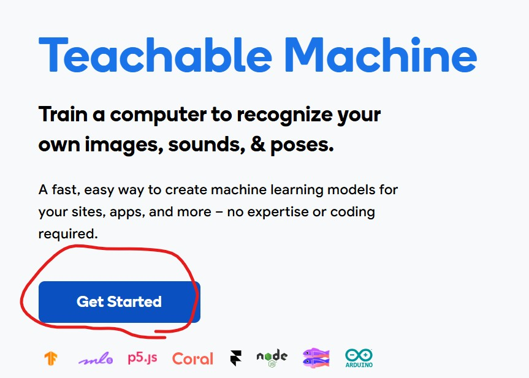
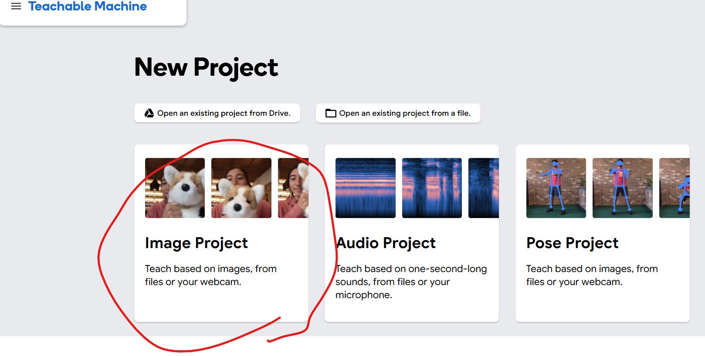
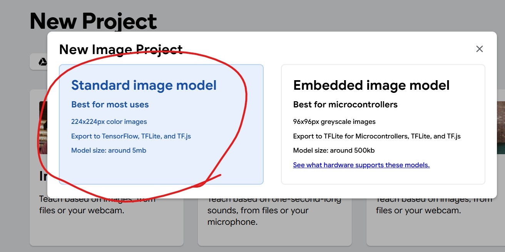
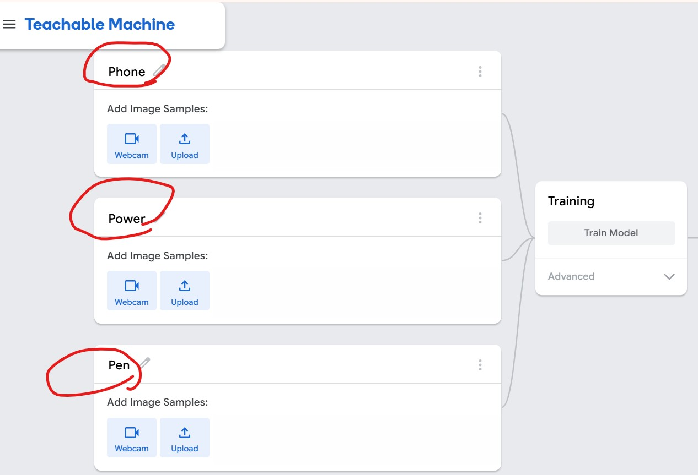
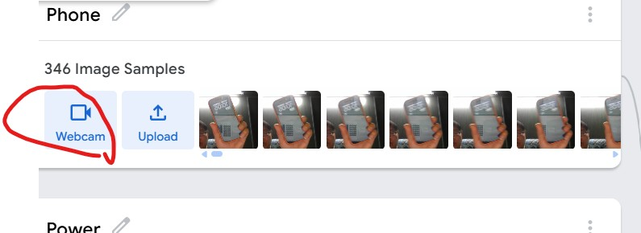
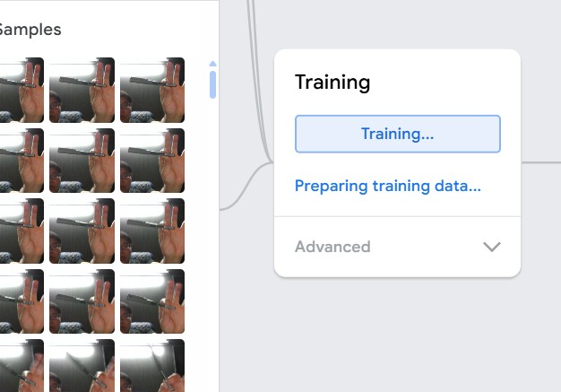
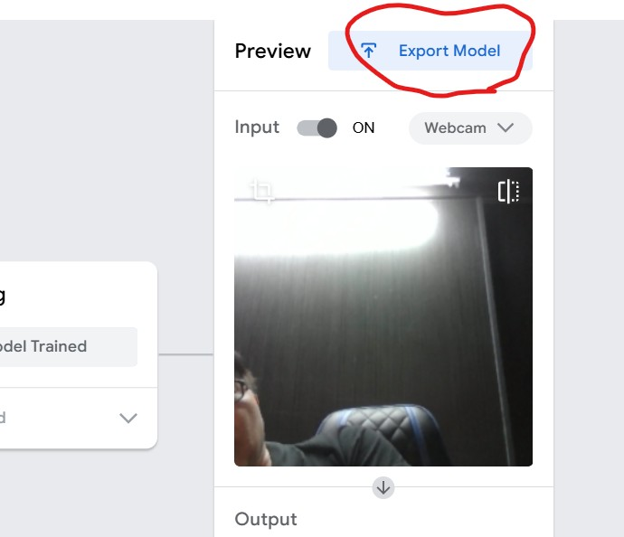
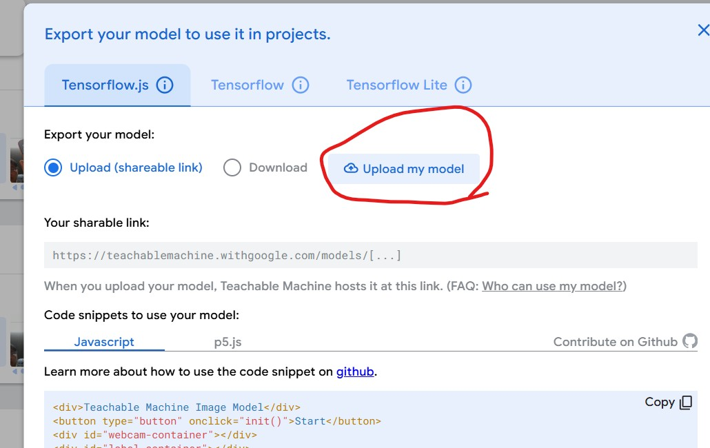
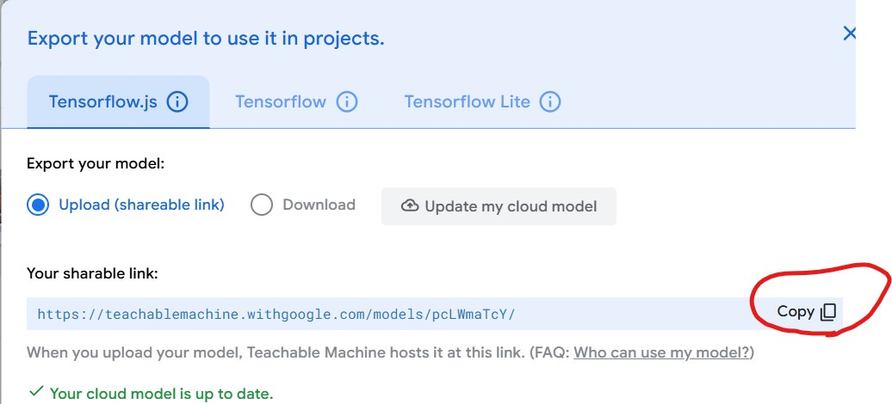

<h2> 連結至以下網址 </h2> <br>
https://teachablemachine.withgoogle.com/

<br>

<br>

<br>

<br>

<br>

<br>

<br>

<br>

<br>


====================================================<br>
#### 使用 Teachable Machine 的範例網頁程式碼
====================================================<br>
```html
<!DOCTYPE html>
<html lang="zh-TW">
<head>
    <meta charset="UTF-8">
    <title>手勢辨識 + 語音播放教學</title>

    <!-- 離線 TensorFlow.js -->
    <script src="tf.min.js"></script>

    <!-- 離線 Teachable Machine Image -->
    <script src="teachablemachine-image.min.js"></script>


    <style>
        body {
            font-family: Arial, sans-serif;
            text-align: center;
        }
        #webcam-container {
            margin-top: 20px;
        }
        .result {
            font-size: 22px;
            margin-top: 15px;
            color: darkblue;
        }
    </style>
</head>

<body>
    <h2>🤖 手勢辨識 + 語音播放（Teachable Machine）</h2>
    <button onclick="init()">啟動鏡頭</button>

    <div id="webcam-container"></div>
    <div id="label-container"></div>
    <div class="result" id="speech-result"></div>

    <script>
        // ★★★ 改成你自己的模型網址 ★★★
        const URL = "https://teachablemachine.withgoogle.com/models/pcLWmaTcY/";


        let model, webcam, labelContainer, maxPredictions;
        let lastSpoken = ""; // 避免重複播放

        async function init() {
            const modelURL = URL + "model.json";
            const metadataURL = URL + "metadata.json";

            model = await tmImage.load(modelURL, metadataURL);
            maxPredictions = model.getTotalClasses();

	    webcam = new tmImage.Webcam(320, 240, false);
            await webcam.setup();
            await webcam.play();
            window.requestAnimationFrame(loop);

            document.getElementById("webcam-container").appendChild(webcam.canvas);

            labelContainer = document.getElementById("label-container");
            labelContainer.innerHTML = "";
            for (let i = 0; i < maxPredictions; i++) {
                labelContainer.appendChild(document.createElement("div"));
            }
        }

        async function loop() {
            webcam.update();
            await predict();
            window.requestAnimationFrame(loop);
        }

        async function predict() {
            const predictions = await model.predict(webcam.canvas);

            let bestClass = "";
            let bestProb = 0;

            for (let i = 0; i < maxPredictions; i++) {
                const prob = predictions[i].probability;
                const text =
                    predictions[i].className + " : " +
                    (prob * 100).toFixed(1) + "%";
                labelContainer.childNodes[i].innerHTML = text;

                if (prob > bestProb) {
                    bestProb = prob;
                    bestClass = predictions[i].className;
                }
            }

            // 門檻值（避免誤判）
            if (bestProb > 0.90 && bestClass !== lastSpoken) {
                speakGesture(bestClass);
                lastSpoken = bestClass;
            }
        }

        function speakGesture(gesture) {
            let message = "";

            switch (gesture) {
                case "Phone":
                    message = "這是 一支手機";
                    break;
                case "Power":
                    message = "這是 行動電源";
                    break;
                case "Pen":
                    message = "這是 一支筆";
                    break;
                default:
                    message = gesture;
            }

            document.getElementById("speech-result").innerText = message;

            const utterance = new SpeechSynthesisUtterance(message);
            utterance.lang = "zh-TW";   // 中文語音
            utterance.rate = 1;         // 語速
            utterance.pitch = 1;        // 音調
            speechSynthesis.speak(utterance);
        }
    </script>
</body>
</html>
```
