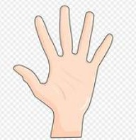

## 切水果遊戲

|手勢A 為開始遊戲|手勢B 為暫停遊戲|手勢C 為暫停遊戲|沒有手勢代表沒有動作|
|---|---|---|---|
| <br> | <br> | <br>| <br><br><br>|

### 以 Teachable Machine 網站先訓練好此模型。(https://teachablemachine.withgoogle.com/)
產生如下模型網址 <br>
https://teachablemachine.withgoogle.com/models/h0J6ufW2H/

遊戲試玩連結
https://derricktsai0904.github.io/JavaScript/TeachAble/Sample/fruit/fruit.html

## 並且撰寫以下程式

```
<!DOCTYPE html>
<html lang="zh-TW">
<head>
<meta charset="UTF-8">
<meta name="viewport" content="width=device-width, initial-scale=1.0">
<title>AI 手勢控制切水果遊戲</title>

<script src="https://cdn.jsdelivr.net/npm/@tensorflow/tfjs@latest/dist/tf.min.js"></script>
<script src="https://cdn.jsdelivr.net/npm/@teachablemachine/image@latest/dist/teachablemachine-image.min.js"></script>

<style>

body{
    margin:0;
    font-family:Arial, Helvetica, sans-serif;
    background:#f5f5f5;
    text-align:center;
}

h2{
    margin:6px 0;
    line-height:1.1;
}

button{
    padding:10px 20px;
    font-size:18px;
    cursor:pointer;
    margin:10px;
}

#mainContainer{
    display:flex;
    justify-content:center;
    align-items:flex-start;
    gap:20px;
    margin-top:10px;
}

#leftPanel{
    width:340px;
}

#rightPanel{
    width:820px;
}

#webcam-container canvas{
    border:3px solid #333;
    border-radius:10px;
}

#label-container{
    margin-top:10px;
    text-align:left;
    background:white;
    padding:10px;
    border-radius:10px;
}

#speech-result{
    font-size:24px;
    color:blue;
    margin-top:10px;
}

#score{
    font-size:28px;
    color:red;
    margin-top:10px;
}

#gameCanvas{
    border:3px solid black;
    background: linear-gradient(to bottom, #87CEEB, #DFF6FF);
    border-radius:10px;
}

#startBtn{
    width:90%;
    margin:10px auto;
    display:block;
}

</style>
</head>

<body>

<h2>🍉 AI 手勢控制切水果遊戲</h2>

<div id="mainContainer">

    <div id="leftPanel">

        <!-- 按鈕已移到鏡頭上方 -->
        <button id="startBtn" onclick="init()">啟動鏡頭</button>

        <div id="webcam-container"></div>

        <div id="label-container"></div>

    </div>

    <div id="rightPanel">

        <div id="speech-result">等待開始...</div>
        <div id="score">分數：0</div>

        <canvas id="gameCanvas" width="800" height="500"></canvas>

    </div>

</div>

<script>

// ======================
// Teachable Machine
// ======================

const URL = "https://teachablemachine.withgoogle.com/models/h0J6ufW2H/";

let model, webcam, labelContainer, maxPredictions;
let lastGesture = "";

// ======================
// Canvas
// ======================

const canvas = document.getElementById("gameCanvas");
const ctx = canvas.getContext("2d");

let score = 0;
let fruits = [];
let particles = [];
let gameRunning = false;

// ======================
// 音效
// ======================

const sliceSound = new Audio(
"https://actions.google.com/sounds/v1/cartoon/pop.ogg"
);

// ======================
// 水果
// ======================

const fruitImages = [];
const fruitURLs = [
"https://cdn-icons-png.flaticon.com/512/415/415733.png",
"https://cdn-icons-png.flaticon.com/512/590/590685.png",
"https://cdn-icons-png.flaticon.com/512/3143/3143643.png",
"https://cdn-icons-png.flaticon.com/512/135/135620.png"
];

fruitURLs.forEach(url=>{
    const img = new Image();
    img.src = url;
    fruitImages.push(img);
});

// ======================
// Fruit
// ======================

class Fruit{
    constructor(){
        this.radius = 40;
        this.image = fruitImages[Math.floor(Math.random()*fruitImages.length)];
        this.x = Math.random()*(canvas.width-100)+50;
        this.y = canvas.height+50;
        this.vx = (Math.random()-0.5)*6;
        this.vy = -(9+Math.random()*5);
        this.gravity = 0.18;
        this.angle = 0;
        this.rotateSpeed = (Math.random()-0.5)*0.25;
    }

    update(){
        this.x += this.vx;
        this.y += this.vy;
        this.vy += this.gravity;
        this.angle += this.rotateSpeed;
    }

    draw(){
        ctx.save();
        ctx.translate(this.x,this.y);
        ctx.rotate(this.angle);
        ctx.drawImage(this.image,-40,-40,80,80);
        ctx.restore();
    }
}

// ======================
// Particle
// ======================

class Particle{
    constructor(x,y){
        this.x=x;
        this.y=y;
        this.vx=(Math.random()-0.5)*10;
        this.vy=(Math.random()-0.5)*10;
        this.life=30;
    }

    update(){
        this.x += this.vx;
        this.y += this.vy;
        this.life--;
    }

    draw(){
        ctx.beginPath();
        ctx.fillStyle="orange";
        ctx.arc(this.x,this.y,5,0,Math.PI*2);
        ctx.fill();
    }
}

// ======================
// 初始化模型
// ======================

async function init(){

    const modelURL = URL + "model.json";
    const metadataURL = URL + "metadata.json";

    model = await tmImage.load(modelURL, metadataURL);
    maxPredictions = model.getTotalClasses();

    webcam = new tmImage.Webcam(320,240,false);
    await webcam.setup();
    await webcam.play();

    document.getElementById("webcam-container").appendChild(webcam.canvas);

    labelContainer = document.getElementById("label-container");
    labelContainer.innerHTML = "";

    for(let i=0;i<maxPredictions;i++){
        labelContainer.appendChild(document.createElement("div"));
    }

    loop();
}

// ======================
// AI loop
// ======================

async function loop(){
    webcam.update();
    await predict();
    requestAnimationFrame(loop);
}

async function predict(){

    const prediction = await model.predict(webcam.canvas);

    let bestClass="";
    let bestProb=0;

    for(let i=0;i<maxPredictions;i++){

        const p = prediction[i].probability;

        labelContainer.childNodes[i].innerHTML =
        prediction[i].className + " : " + (p*100).toFixed(1) + "%";

        if(p > bestProb){
            bestProb = p;
            bestClass = prediction[i].className;
        }
    }

    // 🔥 提高靈敏度（0.90 → 0.80）
    if(bestProb > 0.80 && bestClass !== lastGesture){

        controlGame(bestClass);

        lastGesture = bestClass;

        setTimeout(()=>{
            lastGesture="";
        },700); // 反應更快
    }
}

// ======================
// 控制
// ======================

function controlGame(gesture){

    switch(gesture){

        case "start":
            gameRunning = true;
            document.getElementById("speech-result").innerText="▶ 遊戲開始";
            break;

        case "pause":
            gameRunning = false;
            document.getElementById("speech-result").innerText="⏸ 遊戲暫停";
            break;

        case "cut":
            if(gameRunning) cutFruit();
            break;
    }
}

// ======================
// 切水果
// ======================

function cutFruit(){

    if(fruits.length===0){
        document.getElementById("speech-result").innerText="沒有水果可切";
        return;
    }

    let target=0;
    let highest=fruits[0].y;

    for(let i=1;i<fruits.length;i++){
        if(fruits[i].y < highest){
            highest = fruits[i].y;
            target = i;
        }
    }

    const fruit = fruits[target];

    sliceSound.currentTime=0;
    sliceSound.play();

    for(let i=0;i<20;i++){
        particles.push(new Particle(fruit.x,fruit.y));
    }

    fruits.splice(target,1);
    score++;

    document.getElementById("score").innerText="分數："+score;
    document.getElementById("speech-result").innerText="🍉 切到水果！";
}

// ======================
// 生成水果
// ======================

setInterval(()=>{
    if(gameRunning){
        fruits.push(new Fruit());
    }
},1000);

// ======================
// 遊戲迴圈
// ======================

function gameLoop(){

    ctx.clearRect(0,0,canvas.width,canvas.height);

    for(let i=fruits.length-1;i>=0;i--){
        fruits[i].update();
        fruits[i].draw();

        if(fruits[i].y > canvas.height+100){
            fruits.splice(i,1);
        }
    }

    for(let i=particles.length-1;i>=0;i--){
        particles[i].update();
        particles[i].draw();

        if(particles[i].life<=0){
            particles.splice(i,1);
        }
    }

    requestAnimationFrame(gameLoop);
}

gameLoop();

</script>

</body>
</html>
```
